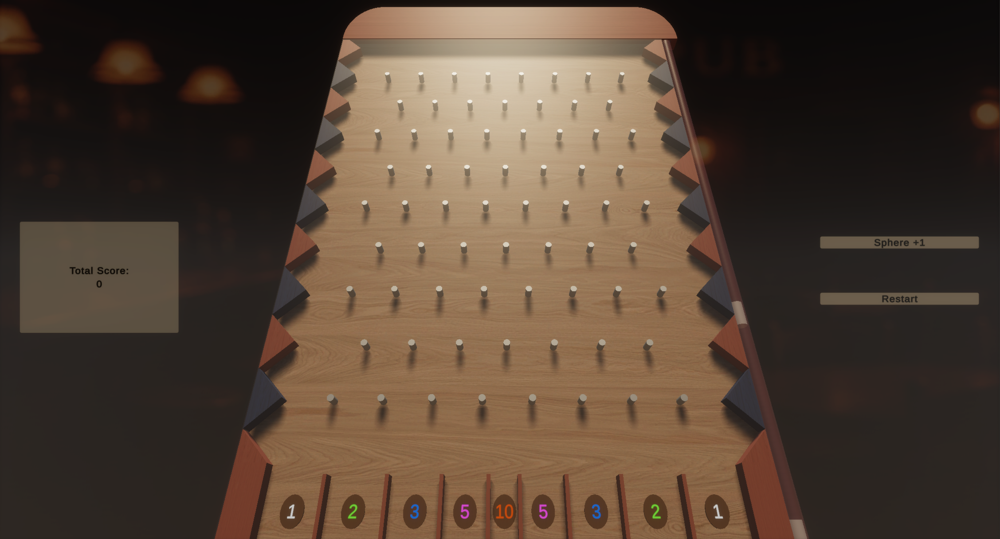

# Simple Plinko Game

**Disclaimer:**  
This is a university assignment, not a full-fledged game! It’s mostly for learning and experimenting

## About The Project

This is a very simplified version of the classic Plinko game, created in Unity. The objective of the game is to score points by dropping spheres down a pegged board and having them land in the highest-scoring slots at the bottom.

## How to Play

1.  **Start the game:** Launch the game in Unity. You will see the Plinko board, a score counter, and buttons to add a sphere and restart the game.
2.  **Add a Sphere:** Click the "Sphere +1" button to release a sphere from the top of the board. The sphere will bounce off the pegs as it descends.
3.  **Scoring:** At the bottom of the board, there are several slots, each with a different point value. Your total score is updated based on which slot the sphere lands in.
4.  **Restart:** You can click the "Restart" button at any time to reset your score to zero and clear the board.

## Game Controls

*   **Sphere +1:** Adds a new sphere to the top of the board.
*   **Restart:** Resets the total score and clears any existing spheres.
*   **Total Score:** Displays your current accumulated score.

